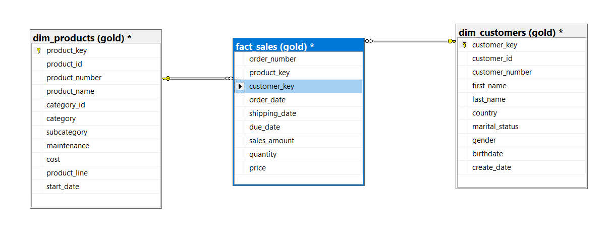

# Data Modeling Documentation

## Star Schema Structure
This data model implements a star schema design to optimize analytical query performance, with `fact_sales` as the central fact table connected to two dimension tables (`dim_products` and `dim_customers`).

---

## Fact Table
### `fact_sales` (gold)
Tracks transactional sales data with foreign keys linking to dimension tables.

- **order_number**: Unique identifier for each order (part of composite PK)
- **product_key**: Foreign key (FK) → `dim_products.product_key` (links to product details)
- **customer_key**: Foreign key (FK) → `dim_customers.customer_key` (links to customer details)
- **order_date**: Date when the order was placed
- **shipping_date**: Date when the order was shipped
- **due_date**: Expected delivery date
- **sales_amount**: Total revenue generated (quantity × price)
- **quantity**: Number of units sold
- **price**: Unit price of the product

**Primary Key**: Composite key (`order_number`, `product_key`, `customer_key`)

---

## Dimension Tables
### 1. `dim_products` (gold)
Master table for product information.

- **product_key**: Primary key (PK) uniquely identifying each product
- **product_id**: Business/product identifier
- **product_name**: Name of the product
- **category/subcategory**: Hierarchical classification
- **cost**: Manufacturing/procurement cost
- **product_line**: Product family/line

**Primary Key**: `product_key`

### 2. `dim_customers` (gold)
Master table for customer demographics.

- **customer_key**: Primary key (PK) uniquely identifying each customer
- **customer_id**: Business/customer identifier
- **first_name/last_name**: Customer's full name
- **country**: Geographic location
- **marital_status/gender/birthdate**: Demographic attributes

**Primary Key**: `customer_key`

---

## Entity-Relationship Diagram (ERD)
  
*(Visualizes the one-to-many relationships: `dim_products` → `fact_sales` ← `dim_customers`)*

---

## Data Loading Process
1. **Dimension Tables First**: Load `dim_products` and `dim_customers` to ensure foreign key references exist
2. **Fact Table**: Populate `fact_sales` with validated keys
3. **Data Quality**: Convert empty strings to `NULL` for missing values

