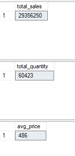
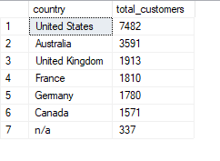
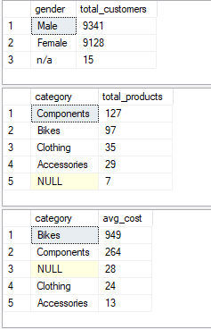
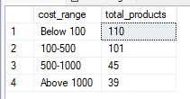
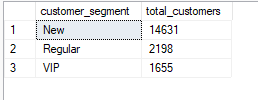
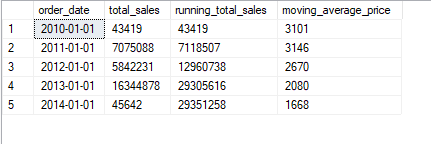

# 📦 Customer Insights Analysis Summary

Welcome to the comprehensive summary of our customer analytics report, which distills over 3 years of business performance (from December 2010 to January 2014) into actionable insights. This analysis covers sales trends, product performance, customer behavior, and geographic expansion—forming the foundation for strategic decision-making across marketing, operations, and growth.

---

## 🗓️ 1. Business Lifecycle Overview

| Metric | Value | Insight |
|--------|-------|---------|
| First Order Date | 2010-12-29 | Launch during holiday season may have accelerated early traction. |
| Last Order Date | 2014-01-28 | Dataset covers 37 months—ideal for trend and seasonality analysis. |
| Duration | 3 years, 1 month | Captures startup, growth, and early maturity phases. |

> **Key Takeaway:** A rich, multi-year dataset offering insights into the business's full commercial cycle.

---

## 👤 2. Customer Demographics

| Attribute | Value | Insight |
|----------|-------|---------|
| Oldest DOB | 1916-02-10 | Likely a data error or shared account; consider for data cleaning. |
| Youngest DOB | 1986-06-25 | Indicates Millennial-dominated customer base. |
| Age Range | 72 years | Suggests broad generational appeal. |

> **Key Takeaway:** Multi-generational customer engagement with strong Millennial presence. Opportunity for refined segmentation and targeting.

---

## 💰 3. Core Business Metrics

| Metric | Value | Insight |
|--------|-------|---------|
| Total Revenue | $29,356,250 | Strong financial performance in mid-premium market. |
| Total Units Sold | 60,423 | Healthy transaction volume—indicates solid operations. |
| Avg. Price/Unit | $486 | Reflects mid-to-high-end product pricing. |
| Total Orders | 27,659 | Avg. 2.2 items per order—suggests successful bundling. |
| SKUs | 295 | Balanced catalog—diverse yet manageable. |
| Total Customers | 18,484 | Significant reach with room for deeper loyalty strategies. |

> **Key Takeaway:** Strong fundamentals with premium positioning, operational robustness, and growth capacity.

---

## ⚙️ 4. Sales Efficiency & Product Performance

- **Revenue per Order:** $1,061  
- **Units per Order:** 2.2  
- **Revenue per Product:** ~$99,500  
- **Inventory Turnover:** 205x

> **Key Takeaway:** High efficiency through upselling and bundling. Revenue concentration risk exists—diversification in SKUs advised.

---

## 📊 5. Customer Activity

| Metric | Count | Insight |
|--------|-------|---------|
| Active Customers | ~12,210 | Good activation rate; core audience engaged. |
| Dormant Customers | ~6,274 | Win-back opportunity through reactivation campaigns. |

> **Key Takeaway:** One-third inactive segment represents untapped value—target with personalized offers and lifecycle marketing.

---

## 🌎 6. Geographic Reach

| Country | Customers | Insight |
|---------|-----------|---------|
| United States | 7,482 | Core market—likely HQ and distribution hub. |
| Australia | 3,591 | Indicates strong overseas performance. |
| UK, France, Germany | ~1,800 each | Potential for deeper EU market penetration. |
| Canada | 1,571 | Solid North American coverage. |
| Unknown | 337 | Data cleaning needed. |

> **Key Takeaway:** Strong global footprint with expansion potential in Europe and Canada. CRM hygiene required for better targeting.

---

## ⚖️ 7. Gender Distribution

| Gender | Count |
|--------|-------|
| Male | 9,341 |
| Female | 9,128 |
| Unknown | 15 |

> **Key Takeaway:** Rare gender balance in sporting retail—enables inclusive branding and broader campaign targeting.

---

## 🛒 8. Product Category Performance

| Category | SKUs | Avg. Price | Revenue | Insight |
|----------|------|------------|---------|---------|
| Bikes | 97 | $949 | $28.3M | Core revenue driver. |
| Components | 127 | $264 | Moderate | Value-added for upgrades. |
| Clothing | 35 | $24 | $339K | Underperforming—reposition or discontinue. |
| Accessories | 29 | $13 | $700K | Useful for bundling and upsell. |
| Uncategorized | 7 | $28 | Negligible | Data cleanup needed. |

> **Key Takeaway:** Prioritize bikes and optimize accessory sales. Reassess or refresh low-performing categories.

---

## 💸 9. Pricing Structure

| Price Range | Products | Share |
|-------------|----------|-------|
| <$100 | 110 | 38% |
| $100–$500 | 101 | 35% |
| $500–$1000 | 45 | 16% |
| >$1000 | 39 | 14% |

> **Key Takeaway:** Tiered pricing supports entry to premium paths. Anchor pricing and value stacking can boost conversions.

---

## 🧠 10. Customer Segmentation

| Segment | Count | Insight |
|---------|-------|---------|
| New | 14,631 | Acquisition engine is healthy. |
| Regular | 2,198 | Needs nurturing via loyalty incentives. |
| VIP | 1,655 | Likely highest revenue drivers. |

> **Key Takeaway:** Focus on converting regulars to VIP through rewards, exclusives, and early access.

---

## 📅 11. Yearly Sales Trends

| Year | Sales |
|------|-------|
| 2010 | $43K |
| 2011 | $7.1M |
| 2012 | $5.8M |
| 2013 | $16.3M |
| 2014 | $45K |

> **Key Takeaway:** 2013 breakout year. 2012 dip may offer operational insights. Use learnings to optimize future launch cadences.

---

## 💵 12. Avg. Order Price Over Time

| Year | Avg. Order Value |
|------|------------------|
| 2010 | $3,101 |
| 2011 | $3,146 |
| 2012 | $2,670 |
| 2013 | $2,080 |
| 2014 | $1,668 |

> **Key Takeaway:** Declining AOV reflects broader audience appeal. Protect basket size with bundling strategies.

---

## 🚴 13. Top Products & Accessories

### 🚲 Best Sellers – Mountain-200 Series:
- Black 46: $1.37M  
- Black 42: $1.36M  
- Silver 38: $1.34M

> **Takeaway:** Mountain-200 dominates—consider expanding color/size variants.

### 🧰 Top Accessories:
- Touring Tire Tube: $7.4K  
- Bike Wash: $7.3K  
- Patch Kit: $6.4K

> **Takeaway:** Modest revenue but essential for increasing AOV and customer satisfaction. Ideal for bundling or bonuses.

---

## 📉 14. Volatility & Forecasting

- Apparel boom (2013) → bust (2014) shows forecasting gaps  
- Bike demand remained stable and predictable  
- Missed opportunities on rising SKUs due to under-promotion

> **Key Takeaway:** Enhance SKU forecasting with seasonality, ML modeling, and early trend detection.

---

## 🧭 15. Strategic Recommendations

### 🔧 Product:
- Expand Mountain-200 line (e.g., carbon frame, smart features)  
- Bundle slow sellers with bestsellers  
- Reposition or rebrand apparel via influencers and performance tech

### 👥 Customer:
- Launch VIP program with perks  
- Win-back campaigns for dormant users  
- Use predictive models for LTV and churn

### 💰 Pricing:
- Maintain tiered structure  
- Use anchor pricing to elevate mid-range appeal  
- Emphasize long-term value in marketing

### ⚙️ Operations:
- Upgrade demand forecasting tools (e.g., Prophet, XGBoost)  
- Audit over/understocked categories  
- Clean CRM data for better segmentation and reporting

---

## ✅ Conclusion

This analysis reveals a business with strong product-market fit, effective premium positioning, and global reach. The next chapter lies in refining customer relationships, optimizing underperforming segments, and embracing data-driven growth strategies. With targeted campaigns, smarter forecasting, and SKU innovation, the business is well-positioned for scalable success.

---

