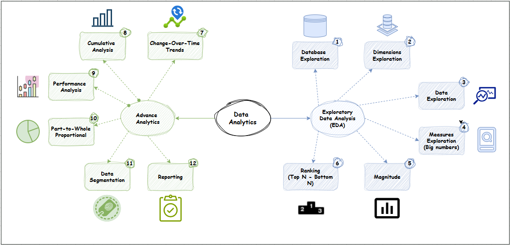

# 🧠 Customer Sales Analytics Project

## Overview

This project delivers end-to-end data analytics on a multi-year customer sales dataset. It uses structured data preparation, modeling, and analysis practices to extract valuable insights for business strategy and growth.

The analytics process follows the full pipeline from raw data to advanced business insights, structured into two major phases:

- **Exploratory Data Analysis (EDA)**
- **Advanced Analytics**

---

## 📁 Data Sources

The project works with three main datasets:

- `gold_customers`: Customer demographics and account data.
- `gold_products`: Product catalog with categories and attributes.
- `gold_sales`: Transactional order and sales data.

---

## 🔧 Data Preparation

Detailed steps were taken to clean and structure the data:

### ✅ Data Examination
- Reviewed file contents and field structures for customers, products, and sales.
- Identified primary keys and foreign key relationships.

### 🧹 Data Cleaning & Transformation
- Standardized date formats (`YYYY-MM-DD`)
- Cleaned categorical variables (e.g., gender, marital status)
- Verified data integrity (e.g., prices > 0, valid customer/product references)
- Derived key fields:
  - Customer Age
  - Order Fulfillment Time
  - Product Age at Sale

### 🔗 Relationship Mapping
- Mapped relationships across datasets
- Validated referential integrity

### 📈 Enhancement & Validation
- Verified sales_amount = quantity × price
- Cross-checked country names, birthdate anomalies, etc.

---

## 🧱 Data Modeling

A **Star Schema** design was used for optimized analytics:

### ⭐ Fact Table: `fact_sales`
Tracks each line-level sales transaction:
- Composite Primary Key: `(order_number, product_key, customer_key)`
- Metrics: `sales_amount`, `quantity`, `price`, `order_date`, `shipping_date`, etc.

### 📐 Dimension Tables:
1. **`dim_customers`**: Customer demographics
2. **`dim_products`**: Product metadata and hierarchy

---

## 📊 Data Analysis Approach

The analysis follows two tracks based on the diagram:

### 🔍 Exploratory Data Analysis (EDA)

1. **Database Exploration** – structure and schema validation  
2. **Dimensions Exploration** – fields, hierarchies, and categories  
3. **Data Exploration** – nulls, outliers, duplicates  
4. **Measures (Big Numbers)** – revenue, units, prices  
5. **Magnitude** – sales volume comparisons  
6. **Ranking** – top-N & bottom-N performers  

### 🔬 Advanced Analytics

7. **Change-Over-Time** – time-series trends by year  
8. **Cumulative Analysis** – aggregate revenue, orders  
9. **Performance Analysis** – best/worst customers/products  
10. **Part-to-Whole** – category contribution to revenue  
11. **Segmentation** – VIP, new, and dormant customer groups  
12. **Reporting** – synthesis of business insights  

---

## 📌 Key Insights

### 🗓️ Business Timeline
- Duration: 3 years and 1 month (Dec 2010 – Jan 2014)
- First Order: Holiday season launch
- Peak year: 2013 with $16.3M in sales

### 👤 Customer Profile
- 18,484 total customers, mostly aged 29–76
- Balanced gender split (Male: 9,341 | Female: 9,128)
- High Millennial engagement, global customer base

### 💰 Business Metrics
- Total Revenue: $29.4M
- Orders: 27,659 (avg. 2.2 items/order)
- Avg. Price: $486/unit
- Top Category: Bikes ($28.3M revenue)

### 🌎 Geographic Reach
- Top markets: USA (7,482), Australia (3,591), EU countries
- CRM needs improvement (337 “Unknown” countries)

### 🧾 Sales Performance
- Revenue per order: $1,061
- Inventory turnover: 205x
- Best Sellers: Mountain-200 Series
- Weakest: Apparel – needs repositioning

### 📈 Trends
- Declining AOV (avg. order value) from 2010 → 2014
- 2012 dip followed by 2013 breakout
- Accessories used for bundling; modest but strategic

---

## 🧭 Recommendations

### 🎯 Product Strategy
- Expand Mountain-200 line with tech upgrades
- Bundle slow sellers with top performers
- Rebrand low performers like apparel

### 🧑 Customer Strategy
- Launch VIP rewards program
- Win-back campaigns for 6,274 dormant users
- Use LTV and churn predictive models

### 💸 Pricing Strategy
- Maintain tiered pricing ($100–$1000)
- Leverage anchor pricing
- Emphasize value in upsell offers

### ⚙️ Operational Strategy
- Upgrade forecasting (e.g., Prophet, XGBoost)
- Clean CRM & dimension data
- Align stock with seasonal trends

---

## 📎 Conclusion

This project showcases how clean data modeling and analytics can yield deep business insights. The company demonstrates product-market fit and global potential. With smarter targeting, bundling, and forecasting, sustainable and scalable growth is achievable.

---

